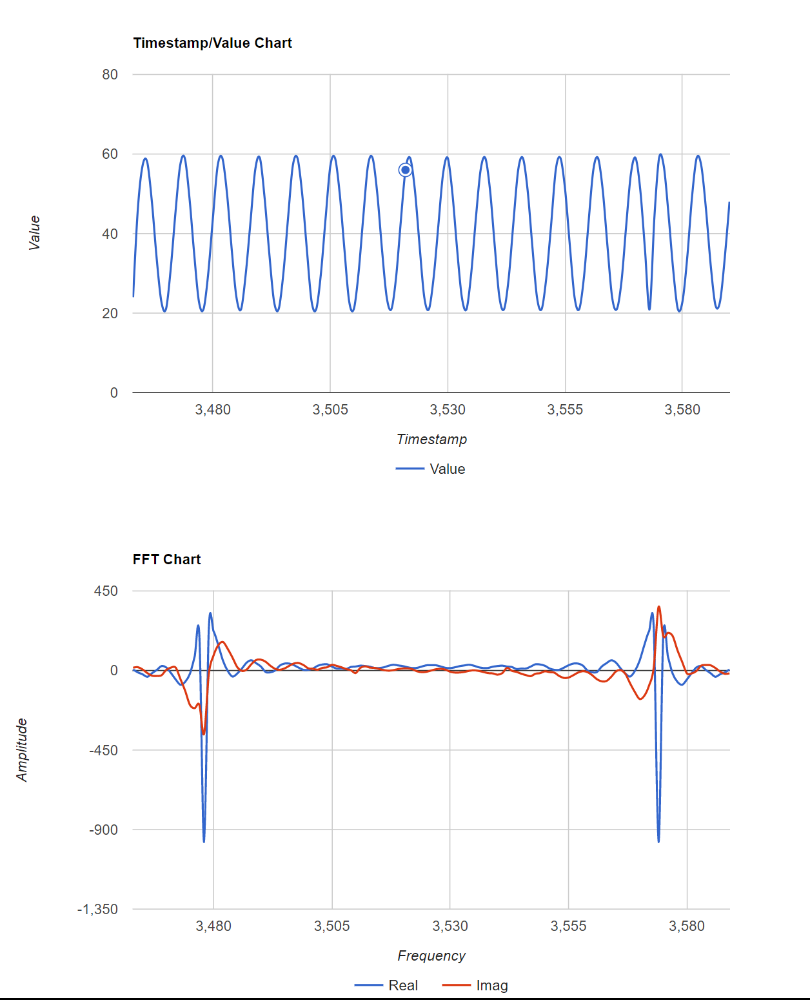
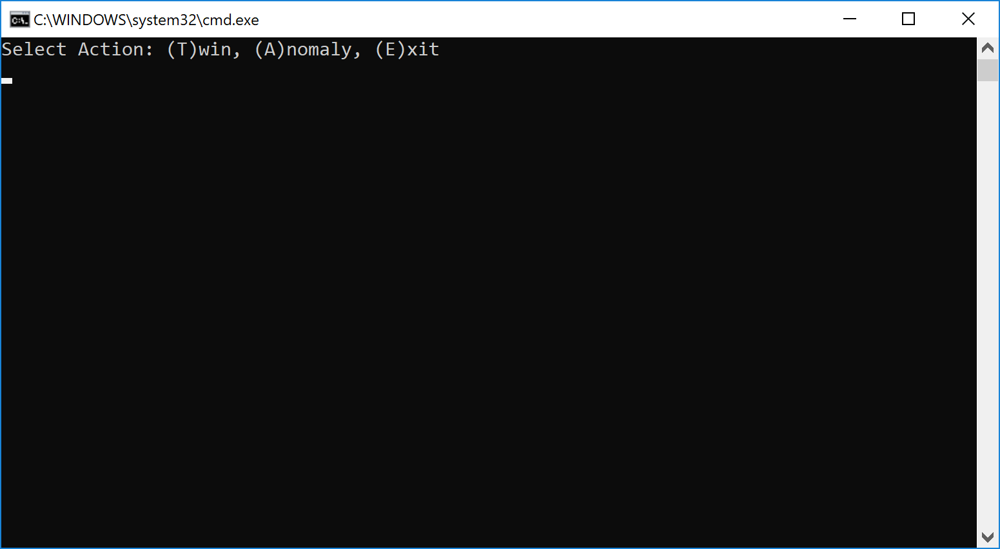
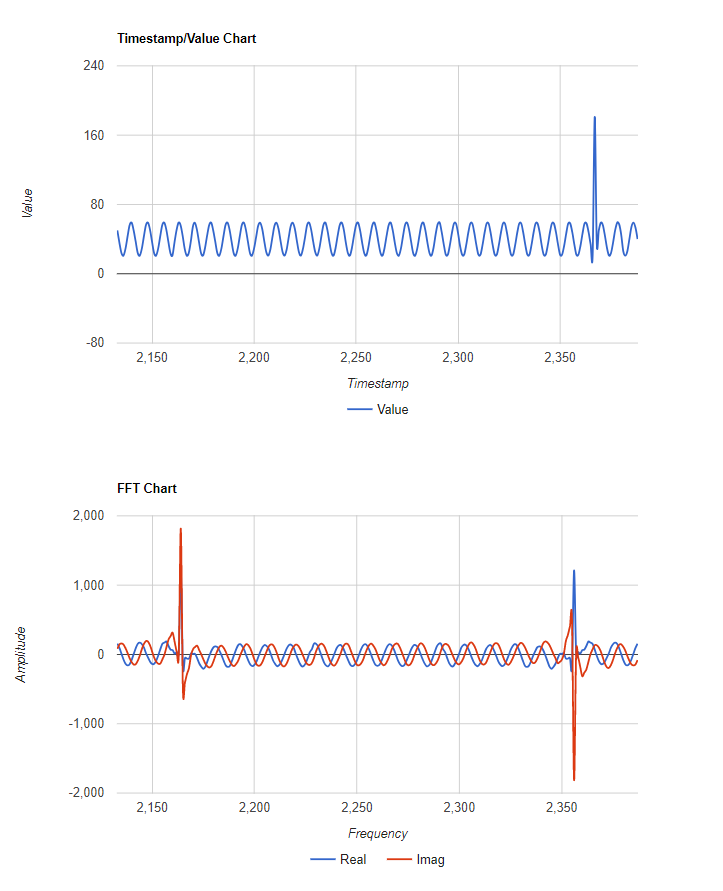

# TypeEdge.AnomalyDetection
High Frequency Unsupervised **Anomaly Detection on the Edge** using  [TypeEdge](https://github.com/paloukari/TypeEdge).

## Prerequisites
The minimum requirements to get started with **TypeEdge.AnomalyDetection** are:
 - The latest [.NET Core SDK](https://www.microsoft.com/net/download/dotnet-core/sdk-2.1.301) (version 2.1.301). To find your current version, run 
`dotnet --version`
 -  An [Azure IoT Hub](https://docs.microsoft.com/en-us/azure/iot-hub/iot-hub-create-through-portal)

## Quickstart

1. Clone this repo:
    
        git clone https://github.com/paloukari/TypeEdge.AnomalyDetection

1. Edit the `IotHubConnectionString` value of the  `/Thermostat.Emulator/appsettings.json` file. You need to use the **iothubowner** connection string from your Azure **IoT Hub**.

1. Build and run the `Thermostat.Emulator` console app. To observe the generated waveform with a Fast Fourier Transformation, visit the visualization URL at http://localhost:5001. This is a visualization web application that runs on the Edge and helps you understand the data stream characteristics. You will something like this:

  

## Injecting ad hoc Anomalies

To inject Anomalies to the waveform, run the `Thermostat.ServiceApp` console app, after editing first the `IotHubConnectionString` value inside the `/Thermostat.ServiceApp/appsettings.json` file. Same as before, you need to use the **iothubowner** connection string from your Azure **IoT Hub**.

This is a Service (cloud) side application that sends twin updates and calls direct methods of the IoT Edge application modules.

  

When you call the Anomaly Direct method, an ad hoc anomaly value is generated. This anomaly is a Dirac delta function (Impulse), added to the normal waveform.

A Dirac delta distribution is defined as:
    
$$f(t_{0})=\int_{-\infty }^{\infty } \! f(t)\delta(t-t_{0}) \, dt$$

where $f(t)$ is smooth function.

The Fourier transformation of the Dirac delta function is:

$$\hat \delta(\omega)=\frac {1}{\sqrt{2 \pi}}e^{-j \omega t_{0}}$$
which in our case, just a sine wave.

You can observe this anomaly in the real time visualization page:

  

>Note: It's interesting to observe the impact that this spike has on the frequency spectrum.