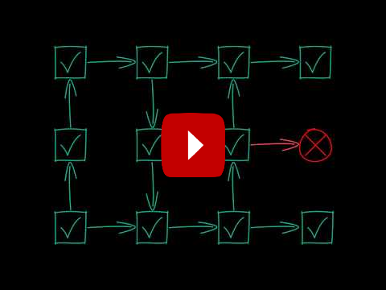
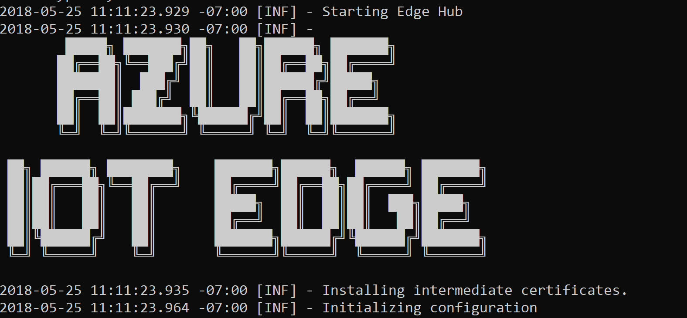
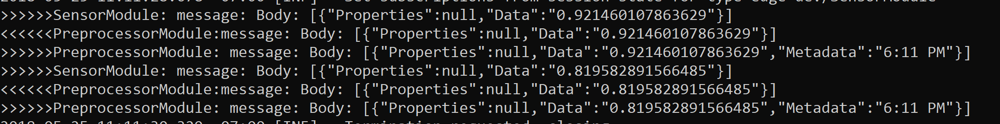
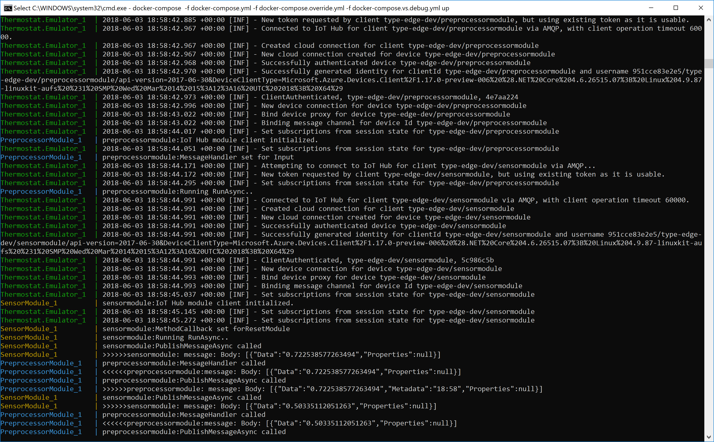
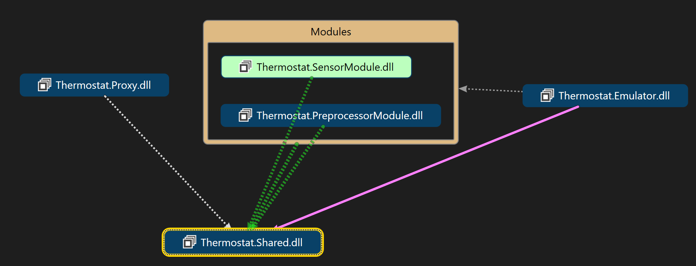

# Microsoft Azure TypeEdge

[](https://dev.azure.com/epicstuff/TypeEdge/_build/latest?definitionId=15)

**TypeEdge** is a strongly-typed development experience for [Azure IoT Edge](https:/azure.microsoft.com/en-us/services/iot-edge).

**TypeEdge**:

- Removes all plain-text configuration files from an IoT Edge application. Configuration is automatically generated  by TypeEdge code bindings.
- Introduces compile-time type checking across all modules.
- Adds the ability to **emulate an IoT Edge device in-memory** without containers.
- Simplifies IoT Edge development, down to a simple F5 experience.

Here is a quick video that demonstrates the value of **TypeEdge**

[](https://youtu.be/_vWcpEjjtI0)

>Note: **TypeEdge** is an **experiment** created by a customer facing team at Microsoft called, Commercial Software Engineering. We work with customers on a daily basis and as a result of that work we created **TypeEdge**. It is being used by partners today around the globe. Please help us improve it by trying it out and providing us feedback.

## Prerequisites

The minimum requirements to get started with **TypeEdge** are:
 - The latest [.NET Core SDK](https://www.microsoft.com/net/download/dotnet-core/sdk-2.1.302) (>= 2.1.302). To find your current version, run 
`dotnet --version`
 -  An [Azure IoT Hub](https://docs.microsoft.com/en-us/azure/iot-hub/iot-hub-create-through-portal) 

To be able to publish your application, you will also need:
 - [Docker](https://docs.docker.com/engine/installation/)
 - An [Azure Container Registry](https://docs.microsoft.com/en-us/azure/container-registry/container-registry-get-started-portal), or any other secure container registry.


## Create a new **TypeEdge** application
Here is the quickest way to get started with **TypeEdge**. In this quickstart you will create an IoT Edge application with two modules and run it in the emulator:

1. Install the TypeEdge .NET Core solution template. Just type:
    ```
    dotnet new -i Microsoft.Azure.TypeEdge.Templates.Application
    ```

    >**Note:** to **upgrade to a newer template version**, you need to clear the dotnet http and template cache first
    ```
    dotnet nuget locals http-cache --clear
    dotnet new --debug:reinit
    ```
2. Copy the **iothubowner** connection string from your Azure **IoT Hub**.
    > The **iothubowner** is required because TypeEdge needs to provision a new device with the generated deployment configuration. 

3. Create a new IoT TypeEdge application:
    > You can customize the TypeEdge application and modules names when you use the template. In the next example, the application is called **Thermostat**, and the two modules are called **SensorModule** and **PreprocessorModule**. These names will be used as class names, so **Pascal casing** is suggested.
    ```
    dotnet new typeedgeapp -n Thermostat -m1 SensorModule -m2 PreprocessorModule -cs "YOUR_IOTHUBOWNER_CONNECTION" -cr YOUR_CONTAINER_REGISTRY
    ```
    >Note: a localhost registry is not supported at the moment.


## Build and debug the application

After you use the template to create a new **TypeEdge** application, all you have to do is build and run the emulator.

1. Navigate in the application folder:

        cd Thermostat

1. Open in VS Code/Visual Studio 2017 and hit F5:

    - VS Code:
        
            code .

    - Visual Studio:
        
            Thermostat.sln

    - .NET Core:
        ```
        dotnet build Thermostat.sln
        cd Thermostat.Emulator
        dotnet run
        ```

    >Note: In all three cases, your application is being emulated in-memory **without containers**. This is very useful for quick develop and test iterations.

You should see now the Edge Hub starting up..



.. and the messages flowing in ..


## Debugging inside the containers

If your modules have system dependencies and you want to debug them inside the containers, you can leverage Visual Studio's *docker support* feature. Simply right click the **docker-compose** project and start it to **debug your application inside the docker containers**.


Alternatively, you can run your application inside the containers in command line:

    docker-compose -f docker-compose.yml -f docker-compose.override.yml up



**Congratulations!**

You just created your first **TypeEdge** application. Continue reading to learn how to deploy this application to an IoT Device, or take the time to understand [how it works](#how).

## Publish the Application

1. You can build the container images using **docker-compose**:
    
        docker-compose build


2. The final step is to push these images to your docker registry. Make sure Docker can access your registry:

        docker login YOUR_REGISTRY -u YOUR_USERNAME -p YOUR_PASSWORD 

    Push the images to your registry

        docker-compose push

    >Note: The registry is configured in the .env file inside the root folder. **If you edit the .env file, make sure you run the the emulator afterwards** to update the cloud IoT Edge Device deployment configuration.

## Device Deployment

Read [here](https://docs.microsoft.com/en-us/azure/iot-edge/quickstart-linux) about the IoT Edge device deployment.

## <a name="how">How it works</a>


**TypeEdge** uses code to define the behavior and structure of a module. A **TypeEdge** application is a collection of **TypeEdge Modules**.

### Module interface

**TypeEdge** leverages **interfaces** to define the structure and behavior of the modules. A typical example of a **TypeEdge module definition** is:  
 
 ```cs
[TypeModule]
public interface ISensorModule
{
    Output<SensorModuleOutput> Output { get; set; }
    ModuleTwin<SensorModuleTwin> Twin { get; set; }

    bool ResetModule(int sensorThreshold);
}
```
This module has a strongly typed output called ***Output*** and the messages type is ***SensorModuleOutput***. Similarly, it has a module twin called ***Twin*** with type ***SensorModuleTwin***
> Note: **TypeEdge** allows you to define multiple twin properties in the same module to enable partial twin updates

Finally, this module has a method that can be invoked (direct method) with the following method signature:

```cs
bool ResetModule(int sensorThreshold);
```

### Module implementation

After describing the module behavior and structure with an interface, the next step is to implement this interface. This is effectively the code that will run in the **TypeEdge** module. Here is an implementation example of the above interface:

<details>
  <summary>Click to see the full <b>SensorModule</b> implementation code</summary>

```cs
public class SensorModule : TypeModule, ISensorModule
{
    public Output<SensorModuleOutput> Output { get; set; }
    public ModuleTwin<SensorModuleTwin> Twin { get; set; }

    public bool ResetModule(int sensorThreshold)
    {
        Logger.LogInformation($"New sensor threshold:{sensorThreshold}");
        return true;
    }

    public override async Task<ExecutionResult> RunAsync(CancellationToken cancellationToken)
    {
        while (!cancellationToken.IsCancellationRequested)
        {
            var message  = new SensorModuleOutput {Data = new Random().NextDouble().ToString(CultureInfo.InvariantCulture)};
            await Output.PublishAsync(message);
            Logger.LogInformation($"Generated Message");

            await Task.Delay(1000);
        }
        return ExecutionResult.Ok;
    }
}
```
</details>


A **TypeEdge** module can override any of the virtual methods of the base class ``TypeModule``. As demonstrated in the above example, the ``RunAsync`` method is used for defining long running loops, typically useful for modules that read sensor values. Another virtual method is ``Configure``, which can be used to read custom module configuration during startup.

The complete ``TypeModule`` definition is:

```cs
public abstract class TypeModule : IDisposable
{
    protected TypeModule();

    public virtual string Name { get; }
    protected ILogger Logger { get; }

    public virtual InitializationResult Init();
    public virtual Task<ExecutionResult> RunAsync(CancellationToken cancellationToken);

    public void Dispose();
    protected T GetProxy<T>() where T : class;
    protected virtual void Dispose(bool disposing);
}
```

### Module Subscriptions
**TypeEdge** uses the pub/sub pattern for all module I/O, except for the direct methods. This means that a module can subscribe to other module outputs, and publish messages to their inputs. To do this, a reference to the module interface definition is required. **TypeEdge** uses dependency injection to determine the referenced modules.

Below is the constructor of the second module included in the application template called ``PreprocessorModule``, that references the ``SensorModule`` via its interface. Using this proxy, the ``PreprocessorModule`` module can subscribe to the ``SensorModule``:

```cs
public PreprocessorModule(ISensorModule proxy)
{
    proxy.Output.Subscribe(this, async msg =>
    {
        await Output.PublishAsync(new PreprocessorModuleOutput
        {
            Data = msg.Data,
            Metadata = DateTime.UtcNow.ToShortTimeString()
        });
        Logger.LogInformation($"Generated Message");
        return MessageResult.Ok;
    });
}
```

In this example, the ``PreprocessorModule`` subscribes to ``SensorModule's`` output, called ``Output``, and defines a subscription callback, a delegate in other words that will be called every time the ``SensorModule`` sends a messages through its ``Output ``.

The complete code of the template's ``PreprocessorModule`` is:

<details>
  <summary>Click to see the full <b>PreprocessorModule</b> implementation code</summary>

```cs
public class PreprocessorModule : TypeModule, IPreprocessorModule
{
    public PreprocessorModule(ISensorModule proxy)
    {
        proxy.Output.Subscribe(this, async msg =>
        {
            await Output.PublishAsync(new PreprocessorModuleOutput
            {
                Data = msg.Data,
                Metadata = DateTime.UtcNow.ToShortTimeString()
            });
            Logger.LogInformation($"Generated Message");
            return MessageResult.Ok;
        });
    }

    public Output<PreprocessorModuleOutput> Output { get; set; }
    public ModuleTwin<PreprocessorModuleTwin> Twin { get; set; }
}
```
</details>


### Emulator
The emulator references the Runtime bits to achieve the emulation. Under the hood, the emulator starts a console application that hosts the Edge Hub and all referenced modules. It will also provision a new Edge device to your designated IoT Hub. This device will contain the complete deployment manifest, ready to be used to an actual device deployment. The emulator uses the same Azure IoT Edge Runtime bits that run on the edge devices, without any containers involved.

To reference modules in an emulator application, you need to register a module definition (interface) with the implementation:

```cs
host.RegisterModule<ISensorModule, Modules.SensorModule>();
```

Finally, all subscriptions beyond to context of a single module can be defined here. For example, an upstream route can be defined using:
```cs
host.Upstream.Subscribe(host.GetProxy<IPreprocessorModule>().Output);
```

Below is the complete template emulator code for reference.


<details>
  <summary>Click to see the full <b>emulator</b> code</summary>

```cs
public static async Task Main(string[] args)
{
    //TODO: Set your IoT Hub iothubowner connection string in appsettings.json
    var configuration = new ConfigurationBuilder()
        .AddJsonFile("appsettings.json")
        .AddEnvironmentVariables()
        .AddDotenv()
        .AddCommandLine(args)
        .Build();

    var host = new TypeEdgeHost(configuration);

    //TODO: Register your TypeEdge Modules here
    host.RegisterModule<ISensorModule, Modules.SensorModule>();
    host.RegisterModule<IPreprocessorModule, Modules.PreprocessorModule>();

    //TODO: Define all cross-module subscriptions 
    host.Upstream.Subscribe(host.GetProxy<IPreprocessorModule>().Output);

    //customize the runtime configuration
    var dockerRegistry = configuration.GetValue<string>("DOCKER_REGISTRY") ?? "";
    var manifest = host.GenerateDeviceManifest((e, settings) =>
    {
        //this is the opportunity for the host to change the hosting settings of the module e
        if (!settings.IsExternalModule)
            settings.Config = new DockerConfig($"{dockerRegistry}{e}:1.0", settings.Config.CreateOptions);
        return settings;
    });
    File.WriteAllText("../../../manifest.json", manifest);

    //provision a new device with the new manifest
    var sasToken = host.ProvisionDevice(manifest);

    //build an emulated device in memory
    host.BuildEmulatedDevice(sasToken);

    //run the emulated device
    await host.RunAsync();

    Console.WriteLine("Press <ENTER> to exit..");
    Console.ReadLine();
}
```

</details>

### Proxy
**TypeEdge** also accelerates the service application development (cloud side application). The provided template will include a Proxy project, useful for cloud side interaction with the TypeEdge application. The code to call a direct method of a TypeEdge module from the could side is literally one line:

```cs
ProxyFactory.GetModuleProxy<ISensorModule>().ResetModule(4);
```

### Solution structure
Apparently, to reference the module definition interfaces and to avoid coupling the module implementation code together, these interfaces need to be defined in a separate project that will be commonly shared across the solution, containing only the definition interfaces and the referenced types.

This images shows the assembly dependencies of the above example



