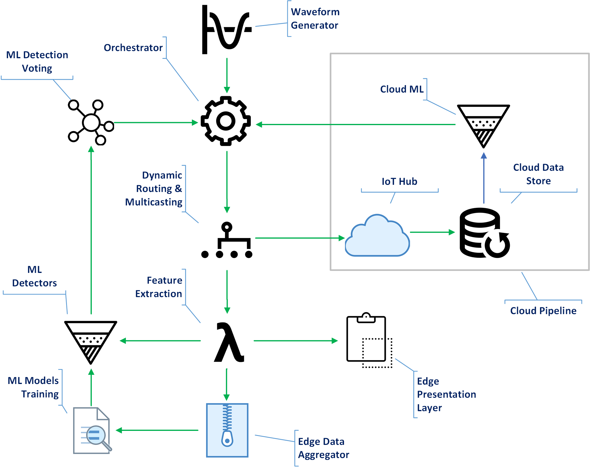

# TypeEdge.AnomalyDetection
High Frequency Unsupervised **Anomaly Detection on the Edge** using  [TypeEdge](https://github.com/paloukari/TypeEdge).

## Prerequisites
The minimum requirements to get started with **TypeEdge.AnomalyDetection** are:
 - The latest [.NET Core SDK](https://www.microsoft.com/net/download/dotnet-core/sdk-2.1.301) (version 2.1.301). To find your current version, run 
`dotnet --version`
 -  An [Azure IoT Hub](https://docs.microsoft.com/en-us/azure/iot-hub/iot-hub-create-through-portal)

## Quickstart

1. Clone this repo:
    
        git clone https://github.com/paloukari/TypeEdge.AnomalyDetection

1. Edit the `IotHubConnectionString` value of the  `/Thermostat.Emulator/appsettings.json` file. You need to use the **iothubowner** connection string from your Azure **IoT Hub**.

1. Build and run the `Thermostat.Emulator` console app. To observe the generated waveform with a Fast Fourier Transformation, visit the visualization URL at http://localhost:5001. This is a visualization web application that runs on the Edge and helps you understand the data stream characteristics. You will something like this:

  

## Preface

Although Anomaly Detection is a well-studied AI/ML field, Edge introduces a multi-constraint hosting environment that need to be investigated en bloc. Anomaly Detection, as with every other compute-intensive processing on the Edge, is a highly tailored, scenario specific balance of trade-offs, such as performance, accuracy, latency, robustness and maintainability. These constraints arise from the nature of the Edge: in contrast to Cloud ML, the Edge ML usually has a non-scalable and fixed size compute capacity, limited memory and storage capabilities, with a possibly unreliable connectivity.

As with most ML on the Edge scenarios, Anomaly Detection on the Edge is assumed to be part of a bigger, composite Cloud+Edge solution. The main reason for having a composite ML solution, is the clear need to leverage the scaling flexibility of the Cloud by offloading there the training stage, and shipping afterwards the pre-calculated ML models on the Edge. This new composite ML application paradigm introduces the need of defining the patterns of operationalization, and proposing a reference DevOps scheme.

## Homoiconicity and ML on the Edge

ML heavily relies on data and data transformations. In it's most abstract form can be annotated as:

  

<!-- $$y = f([x_{1},x_{2} .. x_{n}]) \text{ where}\ x_{n}: \text{input data at}\ t_{n}\text{,}\ y: \text{result} \text{,}\ f: \text{trained model}\ $$ -->

>Note: for temporal input processing, using a set input eliminates the need for state.

This annotation is a clear indication that the ML trained models should not be considered as application data, but rather as code, raising the need for a DevOps pipeline that includes the the ML models as a first-class citizen. As a matter of fact, there are cases where a typical ML model defined as a data structure, is transformed to native, highly optimized source code to achieve better performance.

## Continuous training and DevOps

Having defined a DevOps pipeline that includes the ML model as part of the ML Edge application, simplifies the Anomaly Detection ALM model in continuous training scenarios. The basic premise here is that these ML applications evolve over time, perhaps on a faster pace compared to the traditional non-ML apps. Retraining can happen both on the Edge and on the Cloud, usually with different datasets and frequencies. The hypothesis of the fundamental purpose for training on the Edge is that the Edge needs to be able to minimize the false positives by recognizing the normal (non-anomalous) changes of a signal behavior, while maintaining the same accuracy. This decision of course cannot be generalized to all ML cases, but is part of the aforementioned trade-offs balance that depends on the scenario specific constraints (connectivity, latency, accuracy, etc.)

## High Level Architecture

This is the high level architecture. This diagram depicts all of the logical components of a complete Anomaly Detection on the Edge application, including a cloud pipeline as a reference.

  

 There are many factors to weigh in when designing the Edge Software Architecture based on this logical design. The prime logical design principle was to define an abstract Edge application based on optional generic micro-Services that each one of them can be easily replaced by scenario specific modules. Apparently, the tradeoff of this highly decoupled design is the introduced performance penalty of the increased inter-process communication on the Edge.

 This abstract design serves a second purpose, to define a benchmarking mechanism to evaluate multiple options on different device specific capabilities.
 
 ## Injecting ad hoc Anomalies

To inject Anomalies to the waveform, run the `Thermostat.ServiceApp` console app, after editing first the `IotHubConnectionString` value inside the `/Thermostat.ServiceApp/appsettings.json` file. Same as before, you need to use the **iothubowner** connection string from your Azure **IoT Hub**.

This is a Service (cloud) side application that sends twin updates and calls direct methods of the IoT Edge application modules.

  

When you call the Anomaly Direct method, an ad hoc anomaly value is generated. This anomaly is a Dirac delta function (Impulse), added to the normal waveform.

A Dirac delta distribution is defined as:

<!-- $$f(t_{0})=\int_{-\infty }^{\infty } \! f(t)\delta(t-t_{0}) \, dt$$ -->

  

where $f(t)$ is smooth function.

The Fourier transformation of the Dirac delta function is:

  

<!-- $$\hat \delta(\omega)=\frac {1}{\sqrt{2 \pi}}e^{-j \omega t_{0}}$$ -->
which in our case equals to 1.

You can observe this anomaly in the real time visualization page:

  

>Note: It's interesting to observe the impact this spike has on the frequency spectrum. The discrepancy of the theoretical and the computational results is apparent. This happens because this implementation is an FFT over discrete sampled data, rather than actual Fourier transformation on a theoretical input and for an infinite time scale.
